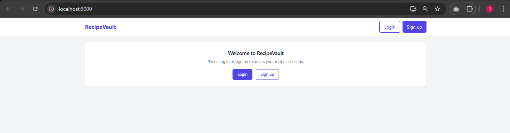
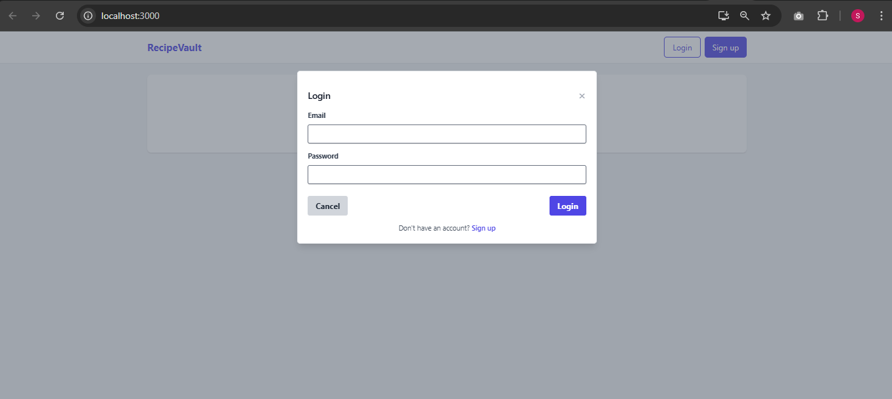
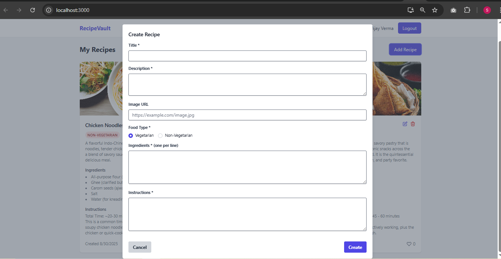

# 📖 Recipe Vault – Your Personal Hub for Cooking Inspiration (Recipe Management System Web App )

Recipe Vault is a modern recipe-sharing platform designed for food lovers, home cooks, and culinary explorers. It allows users to create, share, and discover recipes in an easy and engaging way. Each recipe includes detailed ingredients, step-by-step instructions, and optional images to make cooking more enjoyable.

With built-in features like likes, favorites, and user profiles, Recipe Vault creates a community-driven environment where users can interact with one another’s recipes. Whether you’re looking for vegetarian options, quick snacks, or festive meals, Recipe Vault helps you organize and discover recipes effortlessly.

Key Features:

👨‍🍳 Create, edit, and manage your own recipes.

📸 Upload images to showcase your dishes.

🥗 Mark recipes as vegetarian or non-vegetarian.

❤️ Like/unlike recipes to support other users.

🔍 Browse and search recipes by category or ingredients.

👥 Connect with other users and explore their shared creations.

Recipe Vault is not just a recipe book—it’s a community hub for culinary creativity, making it easy to preserve your favorite dishes and get inspired by others.

## 🚀 Tech Stack

### Backend
- **Java 17+** - Primary programming language
- **Spring Boot 3.x** - Application framework
- **Spring Data JPA** - Database ORM and persistence
- **Spring Security** - Authentication and authorization
- **MySQL 8.0** - Relational database
- **Maven** - Dependency management and build tool
- **JUnit 5 & Mockito** - Unit testing

### Frontend
- **React 18** (or Vue.js 3 / Angular 15) - Frontend framework
- **TypeScript** - Type-safe JavaScript
- **Bootstrap 5** / **Tailwind CSS** - UI styling and components
- **Axios** - HTTP client for API calls
- **React Router** / **Vue Router** / **Angular Router** - Client-side routing
- **React Hook Form** / **Formik** - Form management (if using React)

### Development & Tools
- **Git & GitHub** - Version control and collaboration
- **Postman** / **Insomnia** - API testing
- **Spring Tool Suite** / **VS Code** - Development IDEs

## 📸 Screenshots

### 🔑 Login/Signup Page

### 🍴 Login Tab

### 🏠 Home Page

### ➕ Add Recipe

